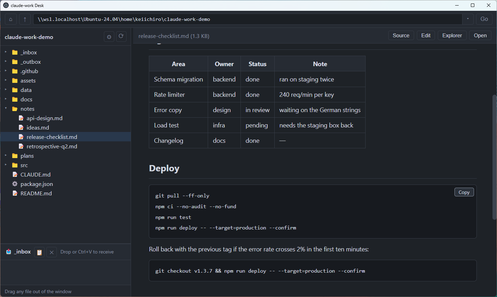
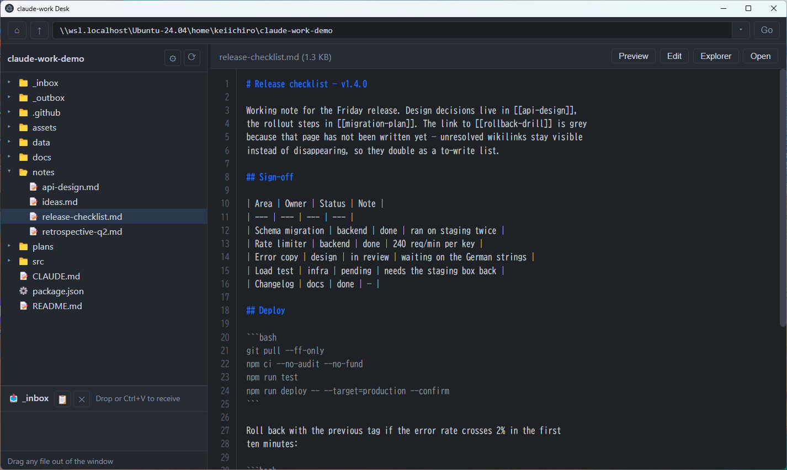
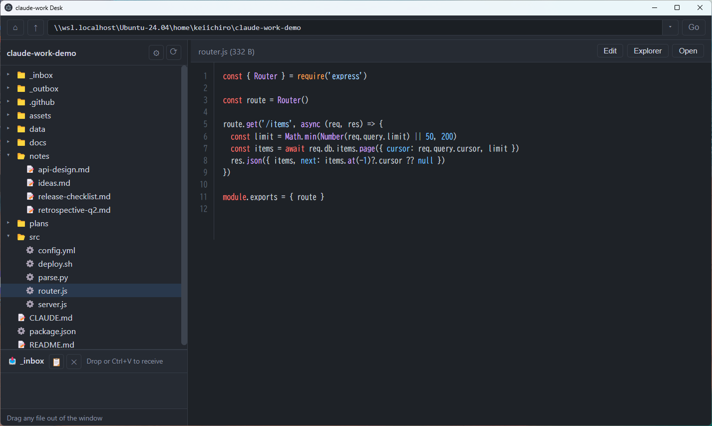
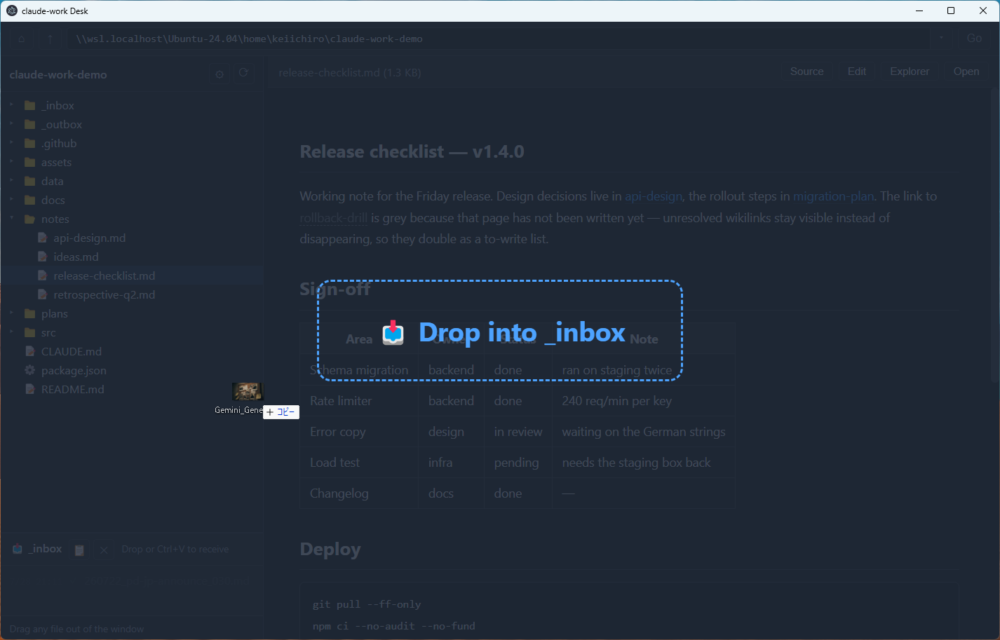
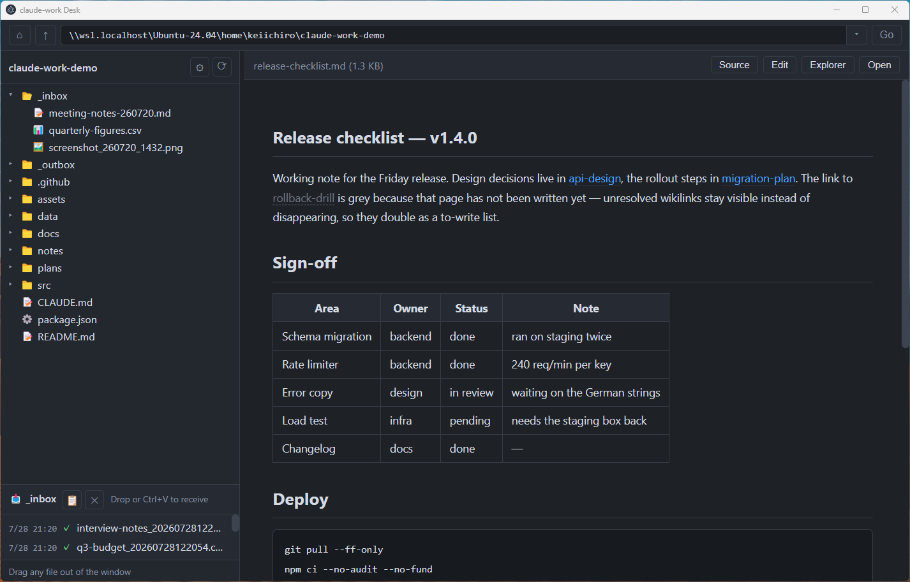
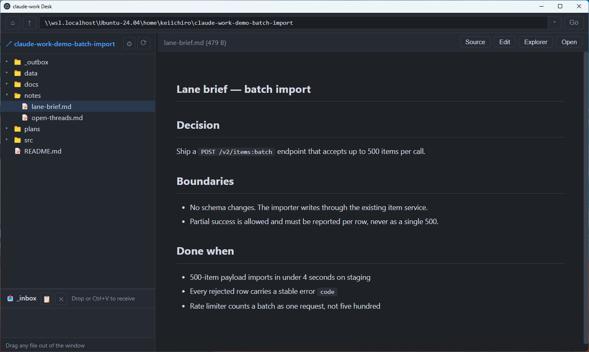
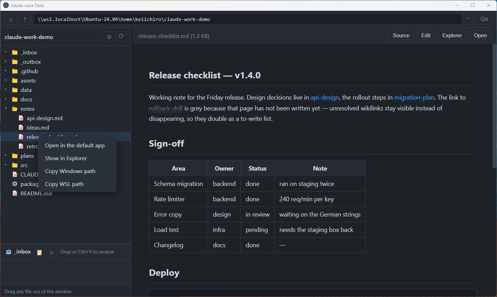
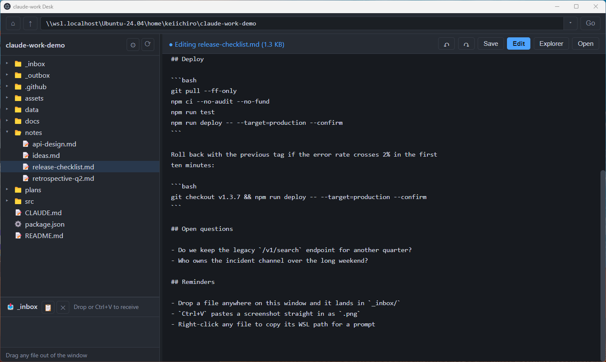
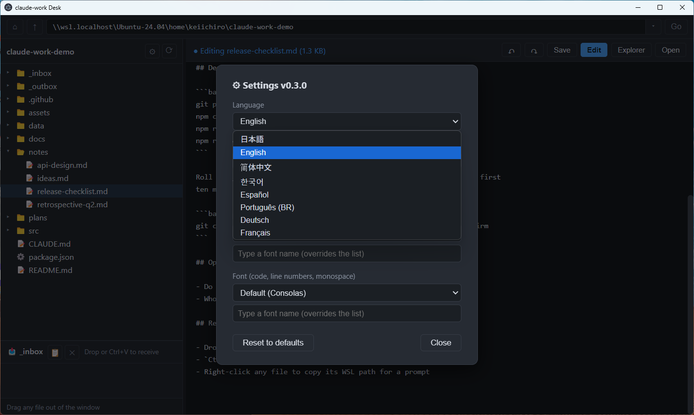

# claude-work Desk

[English README](README.md) ・ [変更履歴](CHANGELOG.ja.md)

**Claude Codeワークスペースと、デスクトップの「受け渡し窓」。ターミナルのClaude Codeを使う人なら、Windows・macOS・WSL、どの環境でも使えます。**

claude.ai やデスクトップアプリからターミナルのClaude Codeに移って、最初に「あれ、不便だな」と思うのがここです — **チャットに何でもドラッグ&ドロップで投げられない**。PDFも、Excelも、スクショも、Webでは窓に落とすだけだったのに、ターミナル版にはドロップする場所がない（画像のペーストだけは効きますが、ファイル添付はできません）。

このアプリはそれを取り戻す1枚のウィンドウです。**何でもこの窓に落とす → ワークスペースの `_inbox/` に着地 → Claudeに「_inbox見て」と言うだけ**。チャットにファイルを投げる感覚が戻ってきます。

もう半分は、Obsidianでワークスペースを見ていた頃の不満の解消です。md以外のファイル（コード・docx等）は開けない、行番号が出ないから「120行目が変」とClaudeに言えない、そして**ファイルを外のアプリへドラッグで出せない**（素のObsidianはファイルの代わりに `obsidian://` リンクを渡すだけ。実ファイルを出すにはプラグインが要ります）。ここでは、mdはレンダリング表示、コードは行番号つきハイライト、PDF/docx/画像もプレビュー、ツリーから外のアプリへは**普通のD&Dでファイルごと出せます**。

## インストール

**ターミナルは要りません。** [**Releases**](https://github.com/tact0225/claude-work-desk/releases/latest) からお使いのOSのインストーラをダウンロードしてください:

- **Windows** — `claude-work-desk-setup-x.y.z.exe` をダウンロードしてダブルクリック。初回だけ SmartScreen が「発行元不明」と警告します（コード署名をしていないため。証明書は有料なので、代わりにコードを公開しています）。**詳細情報 → 実行** で進めばインストール完了、そのままアプリが起動します。
- **macOS** — `claude-work-desk-x.y.z-mac.dmg` をダウンロードして開き、アプリを**アプリケーション**へドラッグ。初回起動時に「**Appleは、"claude-work Desk"にMacに損害を与えたり、プライバシーを侵害する可能性のあるマルウェアが含まれていないことを検証できませんでした**」と出て、**このダイアログからは開けません**（コード署名をしていないため。証明書は有料なので、代わりにコードを公開しています）。次の1回だけの手順で許可してください:
  1. ダイアログは**「完了」で閉じる**（「ゴミ箱に入れる」は押さない）
  2. **システム設定 → プライバシーとセキュリティ** を開いて下へスクロール
  3. 「"claude-work Desk"は…ブロックされました」の行の横の**「このまま開く」**をクリック（この項目は、一度開こうとしてブロックされた後にだけ現れます）
  4. パスワード（またはTouch ID）で確認 → **「開く」**

  以後は普通に起動できます。古めのmacOSなら**右クリック → 開く → 開く**でも通ります。

初回起動でワークスペースフォルダ（Claude Codeが作業しているフォルダなど）を選べば完了。更新はReleasesから新しいインストーラを入れ直すだけ（設定は保持されます）。

**ターミナル派の方**は、従来どおりソースから入れられます:

**Windows（WSL）** — WSLのターミナルで:

```bash
git clone https://github.com/tact0225/claude-work-desk.git
cd claude-work-desk
bash sync_to_windows.sh
```

このスクリプト1本で `%LOCALAPPDATA%\claude-work-desk` への配布・依存インストール・デスクトップショートカット作成まで終わります。更新は `git pull` して再実行するだけ（設定は保持されます）。

**macOS** — ターミナルで:

```bash
git clone https://github.com/tact0225/claude-work-desk.git
cd claude-work-desk
bash setup_mac.sh
```

こちらは自己検査・依存インストールをして、デスクトップに「claude-work Desk.command」を置きます。以後はそれをダブルクリックで起動。更新は`git pull`だけで反映されます。

必要なものと詳しい手順は[セットアップ](#セットアップ)。



*1枚の窓に、ワークスペース全体のツリーと、その横に本物のMarkdownプレビュー、下に何でも投げ込める`_inbox/`。表もレンダリングされ、コードブロックにはホバーでコピーボタンが出て、`[[wikilink]]`はクリックできます。*

## なぜ作ったか

もともとは**WSL上でObsidianを動かして**、その中で全部やっていた。そこで壁に当たった。

日本語入力が通らない。これはObsidianのせいではなく、**WSLgがWindowsのIMEをLinux側のアプリに渡さない**——[その要望](https://github.com/microsoft/wslg/issues/9)は2021年に立ってから今も開いたままだ。入力そのものが効かなくなることもあった。全画面にするとポインタと入力位置が微妙にずれる（[これも未解決](https://github.com/microsoft/wslg/issues/502)）。Windowsキー＋矢印でスナップさせれば直るのだが、そうしないといけないこと自体が不自由だった。

だが何より決定的だったのは、**Claude Codeが「L49」と言ってくること**だった。あのノートの49行目、と。Obsidianには行番号が無い。49まで数えていられない。

それと、Markdownしか開けない。どんなファイルでも中身が見えるものが欲しかった。

だからWSLgの外側——**Windowsネイティブ**で作り直すことにした。ついでに欲が出た。ドラッグしてこの窓に落とすだけで`_inbox/`に入ってほしい。Claude Codeが生成したものは`_outbox/`に出るので、そこからドラッグしてGoogleドライブに放り込めれば一手間減る。worktreeのレーンを構えずに覗けるように、上のパス欄も付けた。

以上が全部です。

## できること

### 読むためのレンダリング、直すための素のまま



*上と同じノートをワンタッチで切り替えたもの。レンダリング表示に「49行目」は存在しません。コーディングエージェントが「ノートの49行目が問題」と言ってきた時に、実際に49行目を見に行くための表示です。*

### ノートだけでなくコードも



*ソースファイルもハイライト＋行番号つきで読めます。エージェントが今書いたものを、エディタを開かずに確認できます。*

### どこに落としても `_inbox/` に着地する



*窓のどこにドラッグしても構いません——狙うべき的はなく、窓全体が的です。`Ctrl/Cmd+V`も同じで、ファイル・スクショ（`.png`として保存）・テキスト（`.md`として保存）を自動で判別します。*

### 入ったかどうかを推測させない



*着地したものは時刻と名前で記録されるので、見に行かなくても何が入ったか分かります。表示は1分で自動的に消えます。同名ファイルは上書きせず、タイムスタンプを足して残します。*

### インボックスを動かさずに別のworktreeレーンを覗く



*パスを貼るとツリーがそこへ飛びます。`/home/you/project-lane` のようなWSLパスもそのまま使えます。ワークスペースの外にいる間はフォルダ名が青字＋`↗`になり、**`_inbox/`の投入先は本体のまま動きません**——覗いている最中にドロップしても、間違ったレーンに入ることはありません。*

### 右クリックして、プロンプトに貼る



*`Copy WSL path` は `/home/you/project/notes/release-checklist.md` の形で返します。ターミナルが実際に求めている形式です。`\\wsl.localhost\...` を毎回手で変換する必要はありません。あるいはパスを介さず、ファイルをそのまま窓の外へドラッグして、Explorerやチャット、Googleドライブへ直接渡すこともできます。*

### 既定は読むだけ、書くのは宣言してから



*プレビューはファイルに書き込みません。**Edit**を押すとボタンが青く反転し、Undo/Redoと保存が現れ、未保存は`●`で示されます。今書き込める状態かどうかを推測する必要がありません。未保存のまま離れようとすると確認が出ます。*

### OSのロケールから選ばれる8言語



*日本語・English・简体中文・한국어・Español・Português (BR)・Deutsch・Français。初回起動はシステムのロケールに従い、対応外なら英語になります。追加・修正は1ファイルだけ（詳細は「言語」）。*

## おすすめの習慣: Claudeに `_outbox/` を持たせる

ドロップ窓がカバーするのは「あなた→Claude」の半分です。逆向きの半分のために、**Claudeがあなた宛ての成果物を置くフォルダ**をワークスペースに1つ作ってください。Deskは `_outbox/` を**最初から新着ウォッチしています** — 新しいファイルが置かれるとツリーが光り、クリックするまで消えません。「終わった? どこに書いた?」と聞く必要がなくなります。

やることはプロジェクトの `CLAUDE.md` に1行足すだけ:

```
私宛ての成果物（レポート・書き出したファイル・ドラフト）は _outbox/ に保存して。
```

名前はワークスペース視点で対になっています: `_inbox/` は入ってくるもの（あなた→Claude）、`_outbox/` は出ていくもの（Claude→あなた）。他のフォルダも同じように見張れます — ツリーで右クリック→**新着を表示**。

## その他の機能

- **ツリー表示**: 遅延読み込みなので大きなリポジトリでも一瞬で開く
- **自動更新**: ツリーと開いているプレビューを2秒ごとに見直すので、エージェントが書いたものが勝手に出てくる。行は増減した分だけ差し替える＝スクロール位置・選択行・展開状態は動かない。外部で書き換わったプレビューは**スクロール位置を保ったまま**読み直す。入力モード中は編集中の内容に触らず、タイトルに外部更新を告げるだけ。最小化中はポーリングを止め、サイドバー下部に最終確認の時刻が出る（ワークスペースに届いていない間は「待機中」、続けて失敗したら赤くなって理由を表示。クリックで今すぐ更新／再開）
- **差分（開いた時点 → 今）**: プレビューヘッダの**差分**を押すと、そのファイルを**開いた時点から今まで**に変わった行だけが1カラムで出る（削除=赤・追加=緑）。基準は自動更新では動かさない＝エージェントが5回書き換えても、開いた時からの変更が**まとめて1画面**で見える。無変更行は前後3行だけ残して`… N行省略 …`に畳むので、長い記事でも読むのは変更点だけ。何か変わっていればボタン自体に`●`が付き、押さなくても気づける。**確認済み**を押すと基準が今の内容に進み、以後は「確認済みにした時点 → 今」の差分になる。書き換わった範囲が広すぎる時は差分を出さずに「大きすぎます」と告げるが、そこから抜ける道も**確認済み**（基準を今に進めれば次の書き換えからまた差分が出る）。同じファイルをもう一度開いても基準は動かない＝再クリックやダブルクリックで未確認の変更を取りこぼさない。自分が入力モードで保存した変更は基準に取り込まれる（自分の編集はエージェントの修正に混ざらない。未確認の変更が残ったまま入力モードに入ろうとすると一度確認する）。対象はMarkdownとコード、入力モード中は出さない
- **新着を表示**: フォルダを右クリック → **新着を表示**。以後そこに現れたファイルはクリックするまで色が残る（数秒で消えない）。畳んでいても気づけるようフォルダの行にも印が出る。対象は**直下のみ**（サブフォルダは個別にONにする運用）、未読は再起動をまたいで残り、ワークスペース全体は指定できない（全部光る＝どれも光っていないのと同じ）
- **パス欄**: `▾`でエクスプローラ風の履歴（直近20件）、`⌂`でワークスペースへ復帰、`↑`で1つ上へ。ファイルのパスを貼った時は親フォルダを開いてその1枚をプレビュー
- **Wikilink**: `[[ページ名]]`をクリックで対象ノートへジャンプ（`←` / Alt+← で戻る）。パスでなく**名前**で引くので、ファイルを移動してもリンクは切れない。探索先は`config.json`の`wikilinkDirs`。解決できないリンクは消さずグレー表示＝「まだ書いてないページ」の一覧を兼ねる
- **Undo/Redo**（`↶` `↷`）は入力モードの時だけ現れる。自前の履歴を持たずChromiumの編集履歴を直接叩くので、ボタンと`Ctrl/Cmd+Z`/`Ctrl/Cmd+Shift+Z`が同じ1本の履歴を共有し、日本語IMEの変換も1操作として戻せる。**保存を挟んでも履歴は切れない**（保存時に編集欄を作り直さない設計）
- **取り出し**: ツリーのファイルをウィンドウ外へドラッグ → Explorerやチャットアプリへ（常にコピー・移動ではない）
- **その他のプレビュー**: `.docx` / 画像 / PDF、表の列幅ドラッグ調整
- **ドロップ先フォルダを選べる**: `_inbox` は既定値にすぎない。⚙で任意のフォルダを指定でき、無ければ作る。ただし**ワークスペース内に限定**——これは形式的な制約ではなく、「覗いているだけのworktreeレーンにファイルが落ちない」という保証そのもの。外を指すsymlink/ジャンクションは拒否し、検査は設定時だけでなく**ドロップの瞬間にも**走る
- **表示設定**: 文字サイズ（Ctrl/Cmd+ホイール・Ctrl/Cmd+＋/−でも）・フォント（UI/等幅）・サイドバー幅。すべて記憶

「`_inbox/`にファイルを放り込む → Claude Codeが処理する」という運用スタイルとセットで真価を出しますが、単なるファイルビューアとしても使えます。

## 必要なもの

**[Releases](https://github.com/tact0225/claude-work-desk/releases/latest) からインストールする場合**（通常はこちら）

- Windows 10/11、または macOS 11（Big Sur）以降 — Apple Silicon / Intel どちらも
- 以上です。Node.js も WSL も不要。**アプリを使うのに WSL は要りません** — 選んだフォルダを覗くだけなので `C:\...` の普通のフォルダでそのまま動きます。WSL のパス（`\\wsl.localhost\...`）「も」動く、というだけです（作者がその構成なので）。

**ソースからインストールする場合**

- Windows: Windows 10/11 + WSL2（インストールスクリプトが WSL で動くため）、Windows側のNode.js（LTS）— https://nodejs.org 、WSL側のrsync（大抵入っています）
- macOS: Node.js（LTS）— https://nodejs.org（`brew install node`でも可）

## セットアップ

### Windows（WSL）

WSLのターミナルで:

```bash
git clone https://github.com/tact0225/claude-work-desk.git
cd claude-work-desk
bash sync_to_windows.sh
```

これで`%LOCALAPPDATA%\claude-work-desk`への配布・依存インストール・デスクトップショートカット作成まで終わります。
初回起動時にワークスペースフォルダを選んでください（ダイアログ左の「Linux」からWSL内を辿れます）。

アップデートは`git pull`して`bash sync_to_windows.sh`を再実行するだけ。設定（フォルダ・フォント等）は保持されます。

### macOS

ターミナルで:

```bash
git clone https://github.com/tact0225/claude-work-desk.git
cd claude-work-desk
bash setup_mac.sh
```

`check.sh`（自己検査）→ `npm install` → デスクトップに「claude-work Desk.command」を生成、までを1本で終えます。以後はその`.command`をダブルクリックで起動。初回起動時にワークスペースフォルダを選んでください。再実行しても同じ結果になります（冪等）。

**Windows版と違い、どこにも配布しません。** `sync_to_windows.sh`が`%LOCALAPPDATA%`へ配るのは、WSLとWindowsでファイルシステムが分かれているからです。Macはcloneした場所がそのまま実行環境なので配る先がありません＝**アップデートは`git pull`だけで反映**されます（依存が変わった時だけ`bash setup_mac.sh`を再実行）。

## 言語

UIは**日本語・English・简体中文・한국어・Español・Português (BR)・Deutsch・Français**の8言語。

初回起動時はOSのロケールから自動判定し、対応外なら英語になります。**⚙ → 言語 / Language**で切替（選択は保存され、画面を読み込み直して反映）。繁体字ロケール（`zh-TW` / `zh-HK`）は現状まとめて簡体字になります。

追加・修正は[`renderer/i18n.js`](renderer/i18n.js)の1枚だけ。キー主軸なので、1つの文言の全言語が同じブロックに並びます:

```js
'btn.save': {
  ja: '保存', en: 'Save', zh: '保存', ko: '저장',
  es: 'Guardar', pt: 'Salvar', de: 'Speichern', fr: 'Enregistrer',
},
```

翻訳が欠けても実行時は英語にフォールバックして空欄にはならず、起動時に欠けている`キー [言語]`を両プロセスがログに列挙します＝**翻訳漏れが黙って通らない**設計です。

## Obsidianから移ってくる人へ

このアプリは`[[wikilink]]`を解決するので、Obsidianを開かなくなってもノートを辿れます。ただし完全な置き換えではなく、**最初に開いた時点でいくつかのリンクはグレーになります**。グレー＝未解決というだけで消えはしないので、慌てず順に直せます。

変わる点:

| | Obsidian | このアプリ |
| --- | --- | --- |
| リンクの探索範囲 | vault全体 | そのノートのフォルダ ＋ `config.json`の`wikilinkDirs`に書いたフォルダ |
| `[[ノート\|別名]]` | 効く | 効く |
| `[[ノート#見出し]]` | 見出しへジャンプ | ノートは開くが、見出しまではスクロールしない |
| `[[ノート^ブロック]]` | 効く | **非対応**（グレー） |
| `![[ノート]]`（埋め込み） | 埋め込まれる | **埋め込まれない**。リンクと`!`が残る |
| frontmatterの`aliases:` | 解決する | **読まない** |
| 綴りの一致 | 多少ゆるい | **完全一致のみ** |

`wikilinkDirs` の既定は汎用的な出発点（ノート自身のフォルダ＋`notes`・`docs`・`wiki/…`）です。自分のフォルダ構成に合わせるときは、次のユーザー設定ファイルを編集してください:

- Windows: **`%APPDATA%\claude-work-desk\user-config.json`**
- macOS: **`~/Library/Application Support/claude-work-desk/user-config.json`**

**アプリ同梱の `config.json` ではありません**——そちらは更新のたびに上書きされる（Windowsは`sync_to_windows.sh`の再配布、Macは`git pull`）ので、書いても次の更新で消えます。

実際に刺さるのは最後の行です。ファイルが`my_note.md`なのに`[[my-note]]`と書いてあると、**黙ってグレーになるだけで誰も気づきません**。私が自分のワークスペースを移した時、**4,267本中201本がこれで切れていました**——ハイフンとアンダースコアの違いだけで。

直すのは機械的な作業なので、Claude Codeに投げてください。「このワークスペースの`[[リンク]]`のうち解決しないものを探して、ハイフンをアンダースコアに変えると実体が見つかるものだけ書き換えて」。`wikilink.js`を指させば、このアプリと同じ`makeResolver()`がどれが死んでいるかを正確に教えます。名前引きは**静かに壊れる**性質なので、時々かけ直す価値があります。

⚠️ **Obsidian Web Clipperを使っているなら、Obsidianは消さないでください。** Clipperの保存先はObsidianのvaultで、[アプリ本体が必要](https://obsidian.md/help/web-clipper)です。このアプリはフォルダを読むだけなのでクリップを受け取れません。「Obsidianはやめるがクリッパーは使い続ける」は成立しない組み合わせです。

## 既知の制約

- **Windowsで使うならWindowsネイティブで動かす前提**です（WSLg上ではExplorerからのD&Dが効かないため）。macOSはネイティブに動くのでこの制約はありません
- 鮮度は**2秒ごとのポーリング**で担保しています（OSの変更通知は使っていません）。WSL越しにはそもそも通知が来ない（`\\wsl.localhost\` に対する`fs.watch`は失敗する）ため一律ポーリングにしてあり、macOSでも同じ経路で動きます＝即時ではなく数秒遅れ、スキャンが重ければ間隔は自動で伸びます。F5か⟳で全体を明示的に更新できます
- ツリーからのドラッグ取り出しは常に**コピー**（移動ではない）
- ソースコードのコメントは日本語のまま（UIそのものは全訳済み）
- 入力モードは素のテキストエリア（編集中のハイライト・補完・差分表示はない）。Undo/Redoはブラウザの編集履歴なので、**入力モードを抜ける／他のファイルへ移ると履歴はリセット**される。**その場の一言直し**用で、長文執筆やコード編集はエディタ側でどうぞ。保存は上書き＝バックアップは取らないので、gitで管理しているフォルダで使うのが前提
- `.xlsx` / `.pptx` / 旧`.doc`はプレビュー非対応（ダブルクリックで既定アプリへ）

## スタンス

作者が自分の毎日の道具として使うために作ったものを、そのまま公開しています。
**as-is・サポートなし**が基本です。Issue/PRは歓迎しますが、返信や取り込みは約束しません。

ほぼ全コードはClaude Code（Anthropic）との共同作業で書かれています。本プロジェクトはAnthropic非公式です。

## License

MIT
